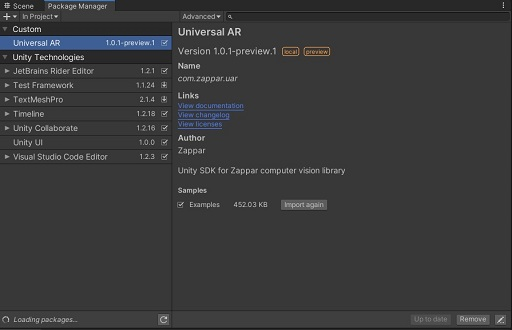

# universal-ar-unity

This project is a Unity package wrapping all ZCV internals and features like - image tracking, face tracking, face mesh, and instant tracking. More details about the features and pipeline can be read here: https://docs.zap.works/universal-ar/unity/

## Importing package into Unity

You can import the package directly from the editor by following these steps:
1. Opening the `Package Manager` from `Window>Package Manager` from Editor
2. Locate the `+` button on top left corner and select `Add package from git URL...`
3. Enter the following URL: `https://github.com/zappar-xr/universal-ar-unity.git`

This will automatically fetch the latest version of the package from Github.

Another option is to define the `universal-ar-unity` package as dependency in your projects' `manifest.json` file located under `Root_Directory>Packages`.

```
{
  "dependencies": {
    "com.zappar.uar": "https://github.com/zappar-xr/universal-ar-unity.git"
  }
}
```

Note that you can modify the source github URL to define any particular `version`, `branch` or `commit` as well. You can read more about it here: https://docs.unity3d.com/Manual/upm-git.html

## Importing Examples

Once the package has been successfully added, you should see additional option in the package window to add sample examples. 



Import them to add example scenes to your main project and start zapping in no time!