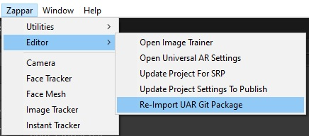
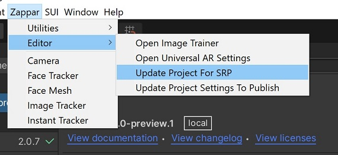
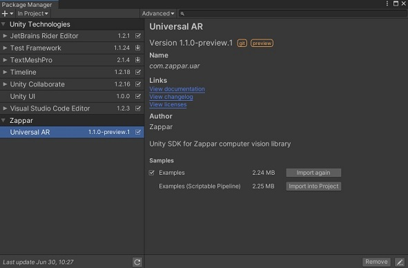
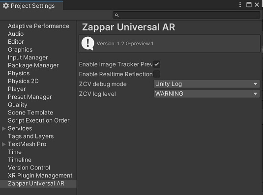
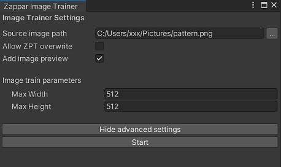
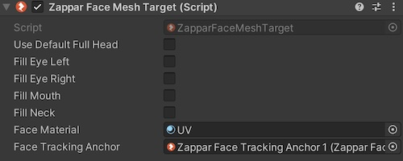
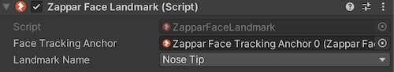
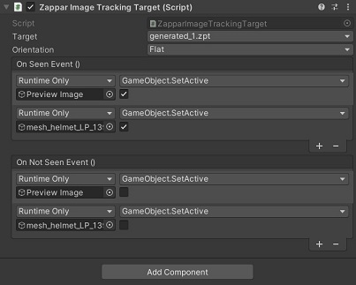

# Universal AR for Unity

This library allows you use Zappar's best-in-class AR technology with content built using the 3D rendering platform Unity, including face tracking, image tracking and instant world tracking.

In addition to this file, documentation can be found over at our [Universal AR for Unity documentation site](https://docs.zap.works/universal-ar/unity/).

You may also be interested in:

- [Zappar for A-Frame](https://www.npmjs.com/package/@zappar/zappar-aframe) (@zappar/zappar-aframe)
- [Zappar for ThreeJS](https://www.npmjs.com/package/@zappar/zappar-threejs) (@zappar/zappar-threejs)
- [Zappar for JavaScript](https://www.npmjs.com/package/@zappar/zappar) (@zappar/zappar), if you'd like to build content with a different 3D rendering platform
- [ZapWorks Studio](https://zap.works/studio), a full 3D development environment built for AR, VR and MR

The [ZapWorks CLI](https://www.npmjs.com/package/@zappar/zapworks-cli) is a set of command line utilities that will be useful to you during development.

# Table of Contents

  * [Importing UAR package into Unity](#importing-uar-package-into-unity)
    + [Update UAR package](#update-uar-package-to-latest-version)
  * [Platform support](#platform-support)
    + [Android](#android)
    + [iOS](#ios)
    + [WebGL](#webgl)
  * [Supporting Unity Scriptable Render Pipeline (SRP)](#supporting-unity-scriptable-render-pipeline)
  * [Importing Examples](#importing-examples)
  * [Zappar Image Training in Editor](#zappar-image-training-in-editor)
  * [Zappar Universal AR Settings](#zappar-universal-ar-settings)
  * [Licensing](#licensing)
  * [Using the Prefabs](#using-the-prefabs)
    + [Zappar Camera Prefab](#zappar-camera-prefab)
    + [Face Tracker Prefab](#face-tracker-prefab)
    + [Face Mesh Prefab](#face-mesh-prefab)
    + [Face Landmark Prefab](#face-landmark-prefab)
    + [Image Tracker Prefab](#image-tracker-prefab)
    + [Instant Tracking Prefab](#instant-tracking-prefab)
  * [Extras](#extras)
    + [Enabling Realtime Reflection](#enabling-realtime-reflection)
    + [Multiple Face Tracking](#multiple-face-tracking)
  * [Advanced Usage](#advanced-usage)
    + [Pipelines and Camera Processing](#pipelines-and-camera-processing)
      - [Constructing and Managing Pipelines](#constructing-and-managing-pipelines)
      - [Constructing the Camera](#constructing-the-camera)
      - [Permissions](#permissions)
      - [Starting the Camera](#starting-the-camera)
      - [Processing Camera Frames](#processing-camera-frames)
      - [Render Frames](#render-frames)
    + [Camera Pose](#camera-pose)
    + [Tracking](#tracking)
      - [Image Tracking](#image-tracking)
        * [Target File](#target-file)
        * [Image Anchors](#image-anchors)
      - [Instant World Tracking](#instant-world-tracking)
      - [Face Tracking](#face-tracking)
        * [Face Anchors](#face-anchors)
        * [Face Mesh](#face-mesh)
  * [Links and Resources](#links-and-resources)

## Importing UAR package into Unity

You can import the package directly from the editor by following these steps:
1. Opening the `Package Manager` from `Window > Package Manager` from Editor
2. Locate the `+` button on top left corner and select `Add package from git URL...`
3. Enter the following URL: `https://github.com/zappar-xr/universal-ar-unity.git`

This will automatically fetch the latest version of the package from Github. Please note it may take a minute or two for the package to appear in the list.

Another option is to define the `universal-ar-unity` package as dependency in your projects' `manifest.json` file located under `Root_Directory>Packages`.

```
{
  "dependencies": {
    "com.zappar.uar": "https://github.com/zappar-xr/universal-ar-unity.git"
  }
}
```

Note that you can modify the source github URL to define any particular `tag`, `branch` or `commit hash`, by adding suffix: `#ID` to the git URL. You can read more about it here: https://docs.unity3d.com/Manual/upm-git.html

### Update UAR package to latest version

In order to directly update the UAR package with the latest version on github use the following Zappar menu option `Zappar/Editor/Re-Import UAR Git Package`.



Please note: we always ensure backward compatibility for new releases, however do go through the [CHANGELOG.md](https://github.com/zappar-xr/universal-ar-unity/blob/main/CHANGELOG.md) to be sure there are no breaking changes between your local version and latest version on Git.

## Platform support

The library is currently supported for Unity's iOS, Android and WebGL build platforms. You can switch between, and build, for each of these platforms without making any code or scene changes. There are a few notes that you should read regarding each of these platforms.

The Zappar plugin features full support for Play mode testing on macOS and Windows. This means that you can preview your scenes using a webcam, right inside the Unity editor. With Play mode you can use face and image trackers, and preview your content without having to produce a full build. **Since instant world tracking requires a device gyroscope sensor, it's not currently supported in Play mode**.


### Android

At this time, the Vulkan rendering API is not supported on Android. Please adjust your player settings on Android to use OpenGLES 2.0, or 3.0.

The library requires Android 6.0 (API version 23) or later so please set "Minimum API level" to this in your player settings.


### iOS

Since the library makes use of the camera, you must set 'Camera Usage Description' in your player settings. This text is shown to the user when the operating system shows the camera permissions prompt.

The default graphics API on iOS is Metal, however there may be cases where you wish to use OpenGL. Should this apply to you, edit the line below in the `Packages/com.zappar.uar/Plugins/iOS/zappar-unity.h` file:

```c++
#define ZAPPAR_METAL_SUPPORT // Comment out this line if you _do not_ want to include support for Metal. 
```

This prevents the Zappar library from linking against the Metal framework.

If you are building a Face Tracked experience (and / or if you're using the Face Mesh) for iOS you will need to add the `ZCV.bundle` file into the root level of your generated Xcode project. This file can be found in `Packages/com.zappar.uar/Resources/ZCV.bundle`, you can navigate to the location from Unity editor as well by selecting the bundle from editor then right-click on it and select `Show in Finder`. When including it into the project make sure that it is selected as a target of "Unity-iPhone" (or the relevant name of your application).

### WebGL

While Unity's WebGL support for mobile is currently 'experimental', we've found it's possible to build great AR experiences with Unity and deploy to the web.

The Zappar library provides an alternative template that shows a simple loading bar while the Unity content is loading, and fills the full browser window. You can use this template by navigating to the 'Resolution and Presentation' section in the Player Settings menu and selecting the 'Zappar2020' template (for Unity 2020) or the 'Zappar' template (for Unity 2019). You can alter this template by editing the Assets/WebGLTemplates/Zappar.../index.html file, or alternatively by placing your own index.html file inside a folder of your choice (itself inside the WebGLTemplates folder). For information on how to customize WebGL templates, please consult the [Unity documentation](https://docs.unity3d.com/Manual/webgl-templates.html).

Due to browser restrictions surrounding use of the camera, you must use HTTPS to view or preview your site, even if doing so locally from your computer. This means that Unity's 'Build and Run' option will not work for previewing and testing your project.

You can use the ZapWorks command-line tool to serve your WebGL output folder over HTTPS for access on your local computer, like this:

```
zapworks serve
```

The command also lets you serve the folder for access by other devices on your local network, like this:

```
zapworks serve --lan
```

Remember to run these commands within the folder that's generated by Unity when you build your project for WebGL - it should contain an `index.html` file.

The ZapWorks CLI does not send a `Content-Encoding` header for Unity's gzip files, so it's best to set the `Publishing settings > Compression Format` setting to `Disabled` or `Enabling` `Publishing Settings > Decompression Fallback` if using the CLI.

**Note you can also make use of menu option `Zappar/Editor/Update Project Settings To Publish` to make these specific changes around setting WebGL-Template and compression settings. Though you should always double check to confirm.**

ZapWorks provides complete serving and hosting for your WebGL-based experiences, should you wish to use it. Find out more over at our (Publishing and Hosting page)[https://docs.zap.works/universal-ar/publishing-and-hosting/] at our documentation site.


## Supporting Unity Scriptable Render Pipeline

In order to use the UAR SDK with Unity Scriptable Render Pipeline (SRP), you'll need to update the zappar editor settings. This setting can be accessed from Zappar menu `Editor/Update Project For SRP`.



This adds an additional scripting symbol `ZAPPAR_SRP` to the Unity project, which updates the internal zappar pipeline to support SRP rendering events. Please note if you were previously using `Standard Pipeline` you can update the existing scenefrom menu `Editor/Update Zappar Scene For SRP` as well. This option updates the camera settings.

If you have any missing material/shader in scene or while adding new zappar asset i.e. `Zappar/Face Tracker`, etc. you can find the appropriate material reference from examples scene. Please check below on how to add sample scenes from the package. Please note that along with updating the material in MeshRenderer component you will also need to update the material reference in Zappar script attached on the same object as well.

## Importing Examples

Once the package has been successfully added, you should see additional option in the package window to add sample examples. You should select either one of the two samples available, depending upon whether or not you are using Unity SRP.



Import them to add example scenes to your main project and start zapping in no time!

## Zappar Universal AR Settings

You can access additional project level settings of UAR from `Zappar/Editor/Open Universal AR Settings`.



The settings currently include options to enable/disable image preview for image tracking and some debugging options.


## Zappar Image Training in Editor

To create a new image target file `*.ZPT` open the `Zappar Image Trainer` Window, which can be accessed from `Zappar/Editor/Open Image Trainer`. Default parameters here should be okay for first time use, but please note that you will need to enable `ZPT Overwrite` explicitly if the file already exists under `StreamingAssets`. Optionally you can also decide not to include image preview with `ZPT` file to minimize your build size.

**Please note here the maxWidth and maxHeight refers to the training model param and doesn't resize your source or preview image. We recommend keeping it unchanged for optimum use.**




## Licensing

If you're building for iOS or Android, or you'd like to self-host a WebGL build on a domain of your own, you must register your app/site with ZapWorks. For more information see the [Licensing page](https://docs.zap.works/universal-ar/licensing/) at our documentation site.


## Using the Prefabs

### Zappar Camera Prefab

Once you've imported the package, the first step is to add the `Zappar Camera` prefab into your scene. Use the menu option `Zappar/Camera` to add zappar camera setup in the active scene. The resulting object is a regular Unity camera component with the following changes:
 - its camera parameters (e.g. focal length) will be set automatically by the Zappar library to match those of the physical camera on your device
 - the physical camera feed will be drawn as a background to your scene
 - by default, the position of the camera is the origin of your scene, pointing down the Z axis. Objects that you track, e.g. the user's face, will move around in your scene so they appear in the correct location to the (stationary) camera.

Remember to remove any other cameras you may have, or to mark the Zappar Camera as your primary/active camera.

The camera object has a few options you may like to change:
 - 'Use Front-Facing Camera': this causes the Zappar library to display the 'selfie' camera to the user (rather than the rear-facing camera) - useful for face filter experiences.
 - 'Camera Attitude From Gyro': with this selected, the camera will remain at the origin of your scene, but rotate according to the device's orientation in 3D space. This means that your scene will remain flat with respect to gravity. This mode is useful if you have lighting effects or physics that require your scene to be aligned with the user's real-world environment.
 - 'Mirror Rear Cameras' and 'Mirror User Cameras': these options can be used to automatically mirror the camera background and 3D content. Users expect the content/image of user-facing cameras to be mirrored.
 - 'Anchor Origin': if this is set to an instance of one of the tracking prefabs, that instance will become the origin of your scene. In this mode the camera will move around that instance in 3D space (instead of remaining at the origin).


### Face Tracker Prefab

Use menu option `Zappar/Face Tracker` to place Face Tracker prefab into your hierarchy, which allows you to place 3D content that's tracked to the user's head. It's ideal for building face filter experiences where users wear AR hats, glasses etc. Once the prefab is in place in your hierarchy, place 3D objects as children of that prefab for them to be tracked from the center of the user's head.


### Face Mesh Prefab



Use menu option `Zappar/Face Mesh` to place Face Mesh prefab into your hierarchy. This prefab provides a 3D mesh that fits with the user's face as their expression changes and their head moves. It exposes a Face Material parameter that can be set to any valid material (a UV map is provided that aids in development). Each of the Fill* options determine whether or not the relevant portion of the mesh is 'filled' when it is rendered.

A Zappar Face Mesh requires a Zappar Face Tracker instance as its "Face Tracker" property (in the inspector). The Face Mesh can appear anywhere in the scene hierarchy, however you should place it as a child of the Face Tracker if you wish for the mesh to appear correctly attached to the face.

### Face Landmark Prefab



Use menu option `Zappar/Face Landmark` to place Face Landmark prefab into your hierarchy. This prefab provides a tracker for facial landmark like - left/right eye, nose tip/bridge/base, etc. User can define specific landmark via the `Landmark Name` property. The specified landmark is tracked in 3D space and respective game object's Transform is updated in scene.

A Zappar Face Landmark requires a Zappar Face Tracker instance as its "Face Tracker" property (in the inspector). The Face Landmark can appear anywhere in the scene hierarchy, however you should place it as a child of the Face Tracker if you wish for the mesh to appear correctly attached to the face.


### Image Tracker Prefab

Use menu option `Zappar/Image Tracker` to place Image Tracker prefab into your hierarchy. This prefab lets you attach 3D content to an image. It's great for putting 3D content onto posters, business cards, flyers etc. Once you've dragged the prefab into your hierarchy, you'll have to set the 'Target Filename' property to the 'target file' of the image you'd like to track. This file contains everything the Zappar library needs to detect and track the image in 3D space. You can generate them using the ZapWorks command-line utility like this:
```
zapworks train myImage.png
```

You can then import the resulting `.zpt` file into the following folder `Assets/StreamingAssets` in Unity (you will need to create a `StreamingAssets` folder inside `Assets` if one doesn't exist). Please note that you will have to manually drag and drop the `.zpt` file into the `StreamingAssets` folder, as Unity will not recognize it as a file type that can be imported using "Import New Asset". You can then set the Image Target ZPT property of the Image Tracking target to the name of this file.




### Instant Tracking Prefab


Use menu option `Zappar/Instant Tracker` to place Instant world tracking prefab into your hierarchy. Instant world tracking refers to the ability to attach content to a point in the world (i.e. anchor), without using a tracking image or marker. Simply attach your content as a child of the ZapparInstantTracking GameObject and it will appear in the correct location. 

The Zappar Instant Tracker prefab will keep the content in front of the camera until the user set the flag for `UserHasPlace`, at which point the content will appear to remain anchored in place. By default this behavior is mapped to user tap event (`PlaceOnTouch`), which is optional and you can instead call `ZapparInstantTrackingTarget.PlaceTrackerAnchor`. You can override this behavior as you wish. Please refer to the [Instant Tracking API](#instant-world-tracking) section for further details.

**Note that this tracking is not supported in the Editor mode, due to lack of sensory data required for SLAM!**

## Extras

### Enabling Realtime Reflection


To enable the realtime reflection for your reflective materials, follow the following process:
1. Make sure realtime reflection is enabled from Unity project settings. `Edit/ProjectSettings/Quality` and check `Realtime Reflection Probes`.
2. Enable `Enable Realtime Refections` from menu `Zappar/Editor/OpenUARSettings`. This will add a new layer `ZapparReflect` to your project.
3. Right click on `ZapparCameraRear` (Camera object containing `ZapparCamera` script) and select `Zappar/AddRealtimeReflectionProbe`.
4. Adjust the `ZapparReflectionProbe` properties according to your project needs.

### Multiple Face Tracking


To enable concurrent tracking of multiple faces, follow the following process:
1. Set the number of faces `Concurrent face trackers` from menu `Zappar/Editor/OpenUARSettings`. Total count would depend upon your use case and device, normally we recommend keeping this below 5.
2. Add multiple face trackers (as per your requirement) in the unity scene `Zappar/Face Tracker`.
3. For each face tracker set the unique `Face Number` in editor. This unique number would ideally be in sequence starting from 0, 1, and so on.

The rest of the controls are same usual. Further this will also work with your face mesh scene as well if it's present as a child of the tracker object.


## Advanced Usage

The prefabs above are great for most use cases, and you may find they've got everything you need for your next AR project. That said, the Zappar library does provide a rich API that you can use should you require detailed control of the computer vision libraries.


### Pipelines and Camera Processing

In the Zappar library, a pipeline is used to manage the flow of data coming in (i.e. the frames) through to the output from the different tracking types and computer vision algorithms. While most projects will only need one pipeline, it is possible to create as many as you like. Each pipeline can only have one active source of frames (i.e. one camera, or one video), so if you'd like to simultaneously process frames from multiple sources then you'll need a pipeline for each.

We have provided a default `ZapparCamera` implementation that acts as a wrapper around a *single* pipeline. This camera manages a list of listeners (tracking targets) and ensures that both the Zappar library and its own pipeline are initialized before tracking targets themselves initialize.


#### Constructing and Managing Pipelines

To create and initialize a pipeline you should call the following function:

```c#
IntPtr pipeline = Z.PipelineCreate();
```

#### Constructing the Camera

Zappar cameras act as inputs to a particular pipeline. To create a camera source, call the following function:

```c#
bool useFrontFacingCamera = false;
string device = Z.CameraDefaultDeviceId(useFrontFacingCamera);
IntPtr camera = Z.CameraSourceCreate(pipeline, device);
```

If you'd like to start the user-facing 'selfie' camera, set `useFrontFacingCamera = true`. 


#### Permissions

The library needs to ask the user for permission to access the camera and motion sensors on the device.

To do this, you can use the following function to show a built-in UI informing the user of the need and providing a button to trigger the underlying platform's permission prompts. 

To request permissions using a default UI you should call:

```
Z.PermissionRequestUi();
```

This will trigger the native permissions prompt on both iOS and Android, and will display a default UI on WebGL. Calling

```
bool permissionGranted = Z.PermissionGrantedAll();
```

will return true once the user has granted the relevant permissions.


#### Starting the Camera

Once the user has granted the necessary permissions, you can start the camera on the device with the following functions:

```c#
Z.PipelineGLContextSet(pipeline);
Z.CameraSourceStart(camera);
```

Note that if you are not using OpenGL as your rendering engine then `Z.PipelineGLContextSet(...)` will result in a no-op and can be omitted.

To switch between the front- and rear-facing cameras during your experience, just create a camera source for each and call `Z.CameraSourceStart(...)` as appropriate.


#### Processing Camera Frames

Call the following functions to populate texture data in the render loop of a Zappar camera:

```c#
Z.Process(pipeline);
Z.PipelineFrameUpdate(pipeline);
Z.CameraFrameUpload(pipeline);
```

This will upload a frame for rendering, and will update the internal state of any associated tracking targets.


#### Render Frames

In the render loop, be sure to update both the projection and texture matrices for the camera:

```c#
int width = Screen.width;
int height = Screen.height;

Matrix4x4 projection = Z.PipelineProjectionMatrix(pipeline, width, height);
Matrix4x4 textureMatrix = Z.PipelineCameraFrameTextureMatrix(pipeline, width, height, useFrontFacingCamera);

GetComponent<Camera>().projectionMatrix = projection;
material.SetMatrix("_nativeTextureMatrix", textureMatrix);
```

A default `CameraMaterial` material object is provided in the `Materials` folder under `Universal AR` package, that can be assigned to the `material` object referenced above. This material must use a custom shader of type `Zappar/CameraBackgroundShader`, an implementation of which is available in the `Resources\Shaders` folder.

The current frame texture can then be attached to the material by calling:

```c#
Texture2D texture = Z.PipelineCameraFrameTexture( pipeline );
if (texture != null) material.mainTexture = texture;
```


### Camera Pose

The Zappar library provides multiple modes for the camera to move around in your Unity scene. You can change this behavior by calling one of the relevant camera pose functions:

- `Z.CameraPoseDefault()`: in this mode the camera stays at the origin of the scene, pointing down the positive Z axis. Any tracked anchors will move around in your scene as the user moves the physical camera and real-world tracked objects.

- `Z.CameraPoseWithAttitude(...)`: the camera stays at the origin of the scene, but rotates as the user rotates the physical device. When the Zappar library initializes, the positive Z axis of world space points forward in front of the user.

- `Z.CameraPoseWithOrigin(...)`: the origin of the scene is the center of the anchor specified by the parameter passed to this function. In this case the camera moves and rotates in world space around the anchor at the origin.

The correct choice of camera pose will depend on your given use case and content. Here are some examples you might like to consider when choosing which is best for you:

- To have a light that always shines down from above the user, regardless of the angle of the device or anchors, use `Z.CameraPoseModeWithAttitude(...)` and place a light shining down the negative Y axis of world space.
  
- In an application with a physics simulation of stacked blocks, and with gravity pointing down the negative Y axis of world space, using `Z.CameraPoseWithOrigin(...)` would allow the blocks to rest on a tracked image regardless of how the image is held by the user, while using `Z.CameraPoseWithAttitude(...)` would allow the user to tip the blocks off the image by tilting it.

If you're using our supplied `ZapparCamera` component, you can access the pose of a `ZapparCamera` in the scene by calling:

```c#
Matrix4x4 cameraPose = ZapparCamera.Instance.GetPose();
```

from any script. Set the `cameraAttitude` parameter of `ZapparCamera` to `true` if you wish for the camera pose to be driven by device attitude. Similarly, attach a `ZapparTrackingTarget` object to the `ZapparCamera.anchorOrigin` property in the inspector if you wish for the camera pose to be driven by a tracked target.

> Note that you do not have to use the provided implementation of `ZapparCamera` and the various tracking types in your own application. They are simply example scripts that provide fully working implementations for working with the basic functionality of the Zappar API.


### Tracking

The Zappar library offers three types of tracking for you to use to build augmented reality experiences:

- *Image Tracking* can detect and track a flat image in 3D space. This is great for building content that's augmented onto business cards, posters, and magazine pages, for example.

- *Face Tracking* detects and tracks the user's face. You can attach 3D objects to the face itself, or render a 3D mesh that fits to (and deforms with) the face as the user moves and changes their expression. You could build face-filter experiences to allow users to try on different virtual sunglasses, for example, or to simulate face paint.
  
- *Instant World Tracking* lets you attach 3D content to a point chosen by the user in the room or immediate environment around them. With this tracking type you could build a 3D model viewer that lets users walk around to view the model from different angles, or an experience that places an animated character in their room.

All tracking types derive from the `ZapparTrackingTarget` class, which exposes the `AnchorPoseCameraRelative()` function. `AnchorPoseCameraRelative`  allows you to drive the pose of the camera from the relevant tracking anchor.

Similarly, all the Zappar tracking types adhere to the `ZapparCamera.ICameraListener` interface. This allows tracking targets to receive a valid pipeline object when both the Zappar library and the relevant pipeline have been initialised. `ICameraListener`s expose an `OnZapparInitialised(IntPtr pipeline)` function that can be used for initialization. Note that you do not have to use these particular components, and can choose to implement your application using the Zappar API as you wish.


#### Image Tracking

##### Target File

To track image content you must use a special 'target file' that's been generated from the source image you'd like to track. You can generate them using the ZapWorks command-line utility like this:

```
zapworks train myImage.png
```

The ZapWorks CLI will generate a .zpt file (i.e. myImage.png.zpt) that should be placed in a folder named StreamingAssets in the root level of your project. The resulting file can be loaded into an image tracker by passing the filename to the `Z.LoadZPTTarget(...)` function.

The following snippet demonstrates how to initialize an image tracking target and load the relevant tracking file:

```c#
private IntPtr imageTracker;
private string targetFilename = "myImage.png.zpt"; 

public void OnZapparInitialised(IntPtr pipeline) 
{
    imageTracker = Z.ImageTrackerCreate(pipeline);
    StartCoroutine(Z.LoadZPTTarget(targetFilename, TargetDataAvailableCallback));
}

private void TargetDataAvailableCallback(byte[] data)
{
    Z.ImageTrackerTargetLoadFromMemory(imageTracker, data);
}
```

##### Image Anchors

Each image tracker exposes anchors for images detected and tracked in the camera view. At this time, only one anchor is tracked by the camera. The pose of an image anchor is exposed by passing in a zero based index to the `Z.ImageTrackerAnchorPose(...)` function, e.g.:

```c#

void Update() {
    if (Z.ImageTrackerAnchorCount(imageTracker) > 0)
    {
        Matrix4x4 cameraPose = ZapparCamera.Instance.Pose();
        Matrix4x4 imagePose = Z.ImageTrackerAnchorPose(imageTracker, 0, cameraPose, m_isMirrored);
        Matrix4x4 targetPose = Z.ConvertToUnityPose(imagePose);
    }
}
```

In your application you can choose whether the pose of the camera is at the Unity origin, or whether the target is at the origin and the camera moves around. To drive the pose of the camera from an image target you should override the `AnchorPoseCameraRelative` function (and ensure your class is derived from `ZapparTrackingTarget`), like so:

```c#
public override Matrix4x4 AnchorPoseCameraRelative()
{
    if (Z.ImageTrackerAnchorCount(imageTracker) > 0)
    {
        return Z.ImageTrackerAnchorPoseCameraRelative(imageTracker, 
                                                      0, /* anchor index */
                                                      m_isMirrored);
    }
    return Matrix4x4.identity;
}
```

#### Instant World Tracking

To track content from a point on a surface in front of the user, create a new instant tracker:

```c#
public void OnZapparInitialised(IntPtr pipeline) 
{
    IntPtr instantTracker = Z.InstantWorldTrackerCreate( pipeline );
}
```

Each instant tracker exposes a single anchor.

To choose the point in the user's environment that the anchor tracks from, call the `InstantWorldTrackerAnchorPoseSetFromCameraOffset(...)` function:

```c#
private uint orientation = Z.InstantTrackerTransformOrientation.MINUS_Z_AWAY_FROM_USER;
Z.InstantWorldTrackerAnchorPoseSetFromCameraOffset(instantTracker, 
                                                   0, 0, -2, 
                                                   orientation);
```

The parameters passed in to this function correspond to the X, Y and Z coordinates (in camera space) of the point to track. Choosing a position with X and Y coordinates of zero, and a negative Z coordinate, will select a point on a surface directly in front of the center of the screen.

#### Face Tracking

The Zappar library enables face tracking experiences on native mobile and WebGL, with no changes to your code. 

Face tracked experiences consist of two main components: a *face tracker* and a *face mesh*. The face tracker reports back the pose of the face, while the face mesh reports the information necessary to generate a mesh that tracks the shape and expressions of the face over time. The following snippet demonstrates how you can initialize a face tracker and a face mesh:

```c#
/* This can be any material you wish */
public Material faceMaterial;
private IntPtr faceTracker;
private IntPtr faceMesh;
private Mesh mesh;
private bool initialised = false;

public bool fillEyeLeft;
public bool fillEyeRight;
public bool fillMouth;
public bool fillNeck;

public void OnZapparInitialised(IntPtr pipeline) 
{
    faceTracker = Z.FaceTrackerCreate( pipeline );
    faceMesh = Z.FaceMeshCreate();

    Z.FaceTrackerModelLoadDefault(faceTracker);
    Z.FaceMeshLoadDefaultFullHeadSimplified(faceMesh, fillMouth, fillEyeLeft, fillEyeRight, fillNeck);

    MeshRenderer meshRenderer = gameObject.AddComponent<MeshRenderer>();
    meshRenderer.sharedMaterial = faceMaterial;

    MeshFilter meshFilter = gameObject.AddComponent<MeshFilter>();

    mesh = new Mesh();
    meshFilter.mesh = mesh;
}
```

The vertices, uvs, and triangles of the mesh are updated at runtime to adapt to the current shape and expression of the face. 

##### Face Anchors

Each face tracker exposes anchors for faces detected and tracked in the camera view. By default a maximum of one face is tracked at a time, however you can change this by calling

```c#
int numFacesToTrack = 2;
Z.FaceTrackerMaxFacesSet(faceTracker, numFacesToTrack);
```

Note that setting a value of two or more may impact the performance and frame rate of the library, so we recommend sticking with one unless your use case requires tracking multiple faces.

You can query the number of face anchors present in a scene by calling

```c#
int numAnchors = Z.FaceTrackerAnchorCount(faceTracker);
```

The current pose of the any face anchors can be retrieved by calling

```c#
int faceAnchorIndex = 0;
Matrix4x4 cameraPose = ZapparCamera.Instance.Pose();
Matrix4x4 facePose = Z.FaceTrackerAnchorPose(faceTracker, faceAnchorIndex, cameraPose, m_isMirrored);
```

##### Face Mesh

In addition to tracking the center of the face using a face tracker, the Zappar library provides a face mesh that will fit to the face and deform as the user's expression changes. This can be used to apply a texture to the user's skin, much like face paint.

On each frame you must call the following three functions to update the internal state of the face mesh:

```c#
int faceAnchorIndex = 0;
float[] identity = Z.FaceTrackerAnchorIdentityCoefficients(faceTracker, faceAnchorIndex);
float[] expression = Z.FaceTrackerAnchorExpressionCoefficients(faceTracker, faceAnchorIndex);
Z.FaceMeshUpdate(faceMesh, identity, expression, m_isMirrored);
```

The raw vertices, normals, uvs, and triangles can then be retrieved by calling:

```c#
float[] vertices = Z.FaceMeshVertices(faceMesh);
float[] normals = Z.FaceMeshNormals(faceMesh);
float[] uv = Z.FaceMeshUvs(faceMesh);
int[] triangles = Z.FaceMeshIndices(faceMesh);
```

Due to platform rendering differences you must transform the mesh variables before rendering. The Zappar library provides a set of utility functions for this:

```c#
Mesh mesh = new Mesh();
mesh.vertices = Z.UpdateMeshVerticesForPlatform( vertices );
mesh.normals = Z.UpdateMeshNormalsForPlatform( normals ) ;
mesh.triangles = Z.UpdateMeshTrianglesForPlatform( triangles );
mesh.uv = Z.UpdateMeshUVsForPlatform( uv );
```

Note that the raw `uv` data is arranged such that each successive pair of values in the array corresponds to the uv data for a single vertex, while the raw `vertices` and `normals` data are both arranged such that each successive triplet of values correspond to a single vertex, and the normal for that vertex, respectively.

The UV image (Package/Materials/uv-map.jpg) was created by [Eugene Opperman](https://www.musecreative.net/portfolio/free-cinema-4d-texture-muse-uv-map-1/) and retrieved from [Muse Creative](https://www.musecreative.net/).


## Links and Resources
* [Web site](https://zap.works/universal-ar/)
* [Documentation](https://docs.zap.works/universal-ar/unity/)
* [Forum](https://forum.zap.works/)
* [Issue tracker](https://github.com/zappar-xr/universal-ar-unity/issues)
* [Source code](https://github.com/zappar-xr/universal-ar-unity)


